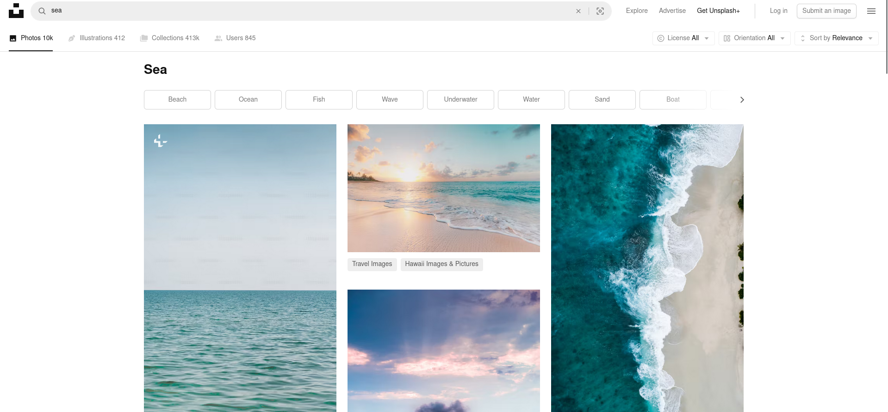

# Unsplash Image Downloader



## About 

* A python script that scrapes images from Unsplash, given `search keyword` and `number of images`, then

* Download the highest resolution images

* watermarked images are execluded

## HTML-based scraping using requests and selectolax

## API-based scraping using requests and json

## Installing

#### Download the code from Github
#### Open CLI and Go to the code folder
#### Run the following command

```
pip install -r requirements.txt
```

## Running
To download images using the Unsplash image downloader, run the following command and pass two arguments, searchKeyword and numberOfImages as follows:

```
py main.py "sea" 20
```

## Output

* A folder `Images/searchKeyword` for example: `Images/sea` should be created in the project folder

* Images with corresponding titles should be downloaded in that folder